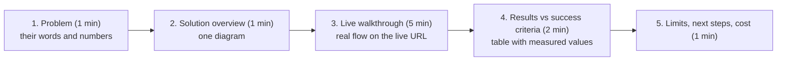

## What

### The 10-minute demo



Tips: use the **live deployed URL** and real-looking data; rehearse and have a recorded backup (Loom); show one failure handled well (the 409 slot-taken, an "I don't know"); end by returning to the client's own success criteria.

Results table example:

| Success criterion | Baseline | Result | How measured |
|-------------------|----------|--------|--------------|
| FAQ answered correctly without staff | 0% | 88% (44/50) | Eval set of 50 real questions |
| Median first response | ~5 h | 3 s | Trace timestamps |
| Double bookings | 2/week | 0 | DB constraint + concurrency test |
| Monthly cost | n/a | ₹__ | Hosting + measured tokens |

### The handover pack

| Document | Contents | Audience |
|----------|----------|----------|
| `README.md` | What it is, screenshots, **Local setup** and **Deployment setup** as separate sections, env var table, how to run tests/evals | Developers |
| `docs/ARCHITECTURE.md` | Diagram, components with reasons, data model, SPOFs, decisions | Developers, client tech lead |
| `docs/API.md` | Endpoints, auth, request/response examples, error format, status codes | Integrators |
| `RUNBOOK.md` | Deploy, roll back, restore from backup, read logs, rotate secrets, common incidents | Whoever is on call |
| `docs/KNOWN-LIMITS.md` | What v1 does not do, risks accepted, v2 backlog (including parked change requests) | Client |
| `docs/COST.md` | Monthly cost breakdown with formulas, sources and date | Client |
| README **AI section** | Which parts AI agents helped build, how each part was verified, where the AI was wrong, and the AI patch-review write-up | Mentors, client |

README skeleton:

```text
# <Project>
One-sentence summary + screenshot + live URL + demo video

## Results
Success criteria table (above), eval pass rate, security checks run

## Local setup
prerequisites; clone; cp .env.example .env; docker compose up; migrate; seed; test commands

## Deployment
server requirements; DNS; env vars on the server; CI/CD; first-owner script; backups; monitoring; rollback (see RUNBOOK.md)

## Architecture (summary + link)
## API (link)
## Security notes: what was tested and how
## AI in this project
- Built with: <agents>; parts AI helped with; how verified; where it was wrong
- AI features: model, prompt version, evals, cost per conversation, data sent to the provider
## Known limits and v2
```

Keep **local setup** and **deployment setup** separate so a developer doesn't accidentally follow production steps on a laptop (or the reverse).

### Honesty in the AI section
Say plainly where the AI was wrong and how you caught it (a test, a review, a trace). This is evidence of judgement, not a confession.

## Why

The client doesn't buy code; they buy an outcome they can rely on. The demo proves the outcome. The handover proves it can survive without you.

## How

1. Update success-criteria results with measured values; fill gaps honestly.
2. Rehearse the demo twice with a timer; record a Loom walkthrough.
3. Write the handover documents; ask a peer to follow the README from a clean clone and fix every snag.
4. Tag a release `v1.0.0`; confirm the live URL, monitoring and backups one last time.

## When

Start drafting handover docs on Day 3 and keep them current; finishing them on demo day is too late.

## Where

The repository, the live site, and a shared folder or email to the client.

## Levels of understanding

<Levels>
<Level id="beginner">

Show the client that their problem is solved, using their own numbers. Leave behind clear instructions so someone else can run and fix it.

</Level>
<Level id="intermediate">

Demo the real flow against success criteria, record it, and deliver README, architecture, API reference, runbook, limits and cost, with local and deployment setup separated and an honest AI section.

</Level>
<Level id="advanced">

Validate docs by having a newcomer execute them, test the runbook (restore, rollback) as a drill, include ownership and escalation, and set a support/maintenance expectation and v2 roadmap.

</Level>
<Level id="industry">

Handover is part of the contract: acceptance criteria, warranty period, training session, access transfer (domains, cloud accounts, secrets), and an exit plan. Good handover reduces support load and builds repeat business.

</Level>
</Levels>

## Common mistakes

<Callout kind="mistake">

- Demoing on localhost with fake data.
- Features tour instead of success-criteria results.
- README that only works on the author's machine.
- Mixing local and production steps.
- Hiding known limits or AI mistakes.
- Leaving secrets or access only in your head or laptop.

</Callout>

## Industry usage

<Callout kind="industry">A clean handover turns a one-off project into a long-term client. Your Week 6 rubric gives 20 points to demo, handover docs and the AI workflow reflection, as much weight as the whole security, tests and evals area plus operations combined.</Callout>

## Exercises

<Challenge kind="exercise" title="Clean-clone test" answer={<p>On a fresh machine or directory follow only the README Local setup. Record every step where you needed knowledge not in the README, fix the doc, and repeat until it works first time. Do the same for Deployment setup on a throwaway server if possible.</p>}>

Have a classmate set up your project from the README alone and note where they got stuck.

</Challenge>

## Interview questions

<Challenge kind="interview" title="Definition of done" answer={<p>Success criteria met and measured, deployed with monitoring and tested backups, documented for operation, risks and limits stated, client trained or demoed, and access transferred.</p>}>

"What does 'done' mean for a client project?"

</Challenge>
