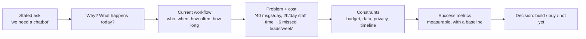

## What

A **forward-deployed engineer (FDE)** sits with the client, learns their real workflow, and ships a solution that changes a number they care about. **Discovery** is the structured conversation that finds the real problem. The first idea the client states ("we need a chatbot") is usually a *solution*; the *problem* is underneath ("we lose bookings because nobody answers WhatsApp after 6 pm").



### The 30-minute call (agenda)

| Min | Topic | Example questions |
|-----|-------|-------------------|
| 0-5 | Context | "Tell me about your business and your day." |
| 5-15 | Current workflow | "Walk me through the last time this happened. What happened first? Then?" "How many per day/week? How long does each take? Who does it?" |
| 15-20 | Pain and cost | "What goes wrong? What does it cost you (time, money, customers)?" "What have you tried?" |
| 20-25 | Constraints | "Budget range? Where does the data live? Anything we must not share with outside services? Deadline and why?" |
| 25-30 | Success | "In 3 months, what number tells you this worked?" Then summarise back and confirm. |

Rules: ask open questions; ask for **examples** and **numbers**; don't pitch solutions early; write down their exact words; ask "what else?" and "why does that matter?"; end by reading your notes back.

## Why

Building the wrong thing fast is the most expensive mistake. A problem statement in the client's own words and numbers prevents scope arguments later, tells you what *not* to build, and gives the demo something to be measured against.

## How

Write a one-page **problem statement** (template):

```text
CLIENT: <business, contact, date>

PROBLEM (their words):
"<direct quote>"

CURRENT WORKFLOW:
1. <step> (who, tool, time)
2. ...

NUMBERS (baseline):
- ~120 appointment requests/week arrive via WhatsApp
- ~25 minutes/day reception time answering the same 15 questions
- ~8 requests/week unanswered for more than 24h (client estimate)

CONSTRAINTS:
- Budget: <range>  - Timeline: <date>  - Data/privacy: <rules>  - Tools they already use: <list>

SUCCESS CRITERIA (measurable):
1. 70% of FAQ questions answered correctly without staff (measured on 50 real questions)
2. Median response time under 1 minute, 24/7
3. Zero double bookings; every booking confirmed by the customer
4. Cost to operate under <amount>/month

OUT OF SCOPE (v1):
- <explicitly list>

OPEN QUESTIONS / ASSUMPTIONS:
- <list>

SIGN-OFF: <client name, date>
```

Good success criteria are **specific, measurable, with a baseline and a way to measure**. Bad: "customers are happier". Good: "average first response time drops from ~5 hours to under 1 minute, measured from message timestamps".

## When

Do discovery before any architecture or code, even if the brief seems obvious, and again whenever the client's situation changes materially. Keep it short enough that the client stays engaged.

## Where

Week 6 Day 1 with your mentor as the client. In the real world: a call or on-site visit, followed by a written summary the same day.

## Levels of understanding

<Levels>
<Level id="beginner">

Before building anything, listen. Ask the client to describe what happens today, how often, and how much time or money it costs. Write it down in their words and ask them to confirm.

</Level>
<Level id="intermediate">

Separate problem from solution, quantify the baseline, identify constraints (budget, privacy, timeline, existing tools), define measurable success criteria, and list what's out of scope. Get written sign-off on a one-page statement.

</Level>
<Level id="advanced">

Map stakeholders (user, buyer, operator), find the real decision-maker, look for the cheapest solution that moves the metric (maybe a template or a process change), probe for hidden constraints (compliance, legacy systems), and identify risks early (data quality, adoption, change management).

</Level>
<Level id="industry">

FDEs combine product, engineering and consulting: they run discovery, prototype quickly in the client's environment, measure outcomes, and feed learnings back to product. The artefact trail (problem statement, scope, decisions in writing) protects both sides when memories differ.

</Level>
</Levels>

## Common mistakes

<Callout kind="mistake">

- Jumping to a solution ("let's use RAG") before understanding the workflow.
- Vague success criteria with no baseline.
- Paraphrasing the client into jargon instead of using their words and numbers.
- Not asking about data sensitivity and who approves AI providers.
- Skipping the read-back and sign-off.
- Promising features during the call.

</Callout>

## Industry usage

<Callout kind="industry">Teams review discovery notes the way they review code. A missing baseline number is the first thing a reviewer flags, because without it you cannot show impact in the demo.</Callout>

## Exercises

<Challenge kind="exercise" title="Run the call" answer={<p>Your notes should include at least three direct quotes, three numbers with units, the current workflow in steps, two constraints, and success criteria each with a measurement method. Read the notes back to the client before the call ends.</p>}>

Run a 30-minute discovery with your mentor-client. Produce the one-page statement and get sign-off.

</Challenge>

<Challenge kind="debug" title="Fix the success criteria" answer={<p>Rewrite each into measurable statements with baselines and methods, e.g. &quot;Reduce average first-response time from ~5h to under 1 minute (message timestamps)&quot;, &quot;Answer 70% of a 50-question real FAQ set correctly without staff (eval)&quot;.</p>}>

Improve these: &quot;The bot should be helpful&quot;, &quot;Customers should be happier&quot;, &quot;It should save time&quot;.

</Challenge>

## Interview questions

<Challenge kind="interview" title="Client asks for a chatbot" answer={<p>Ask what problem they want solved: volume, what questions, who answers now, cost of delay, data constraints, and how they will judge success. Then decide if a bot is the best answer.</p>}>

"A client says 'we want an AI chatbot'. What do you do first?"

</Challenge>
